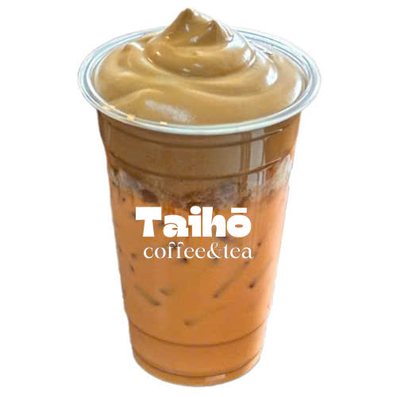

# ☕ Taihō Coffee & Tea — Landing Page

> Premium Vietnamese take-away coffee brand landing page with a minimalist Apple-like aesthetic.



## ✨ Features

- 🌙/☀️ **Dark & Light Mode** with localStorage persistence
- 🎨 **Premium Design** — Glassmorphism, smooth animations, canvas particles
- 📱 **Fully Responsive** — Mobile-first with hamburger menu
- ⚡ **Modular Architecture** — 11 CSS + 4 JS files, cleanly separated
- 🔍 **Menu Filtering** — Category tabs (Cà phê / Trà / Nước ép / Đặc biệt)
- 📋 **Order Form** — Glassmorphism card with validation feedback

## 🎨 Color Palette

| Color | Hex | Usage |
|-------|-----|-------|
| Deep Navy | `#1D2645` | Primary dark background |
| Warm Beige | `#F3EFE8` | Light background |
| Soft Ivory | `#FAF8F4` | Text on dark |
| Coffee Brown | `#6B4A35` | Accent (light mode) |
| Caramel Gold | `#C58A4A` | Accent (dark mode) |

## 📁 Project Structure

```
├── index.html
├── css/
│   ├── variables.css    # Design tokens
│   ├── base.css         # Reset & utilities
│   ├── animations.css   # Keyframes & reveals
│   ├── navbar.css       # Navigation bar
│   ├── hero.css         # Hero section
│   ├── about.css        # About section
│   ├── signature.css    # Signature drinks
│   ├── lifestyle.css    # Lifestyle section
│   ├── menu.css         # Menu grid
│   ├── booking.css      # Order form
│   └── footer.css       # Footer
├── js/
│   ├── theme.js         # Dark/Light toggle
│   ├── particles.js     # Canvas particles
│   ├── animations.js    # Scroll animations
│   └── main.js          # Loading & form
└── img/                 # Product images
```

## 🚀 Getting Started

Simply open `index.html` in your browser — no build tools required.

## 📝 License

© 2025 Taihō Coffee & Tea. All rights reserved.
